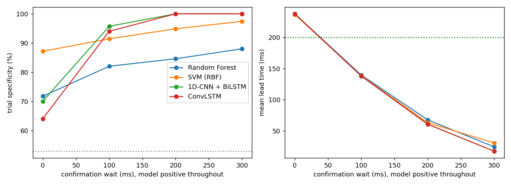
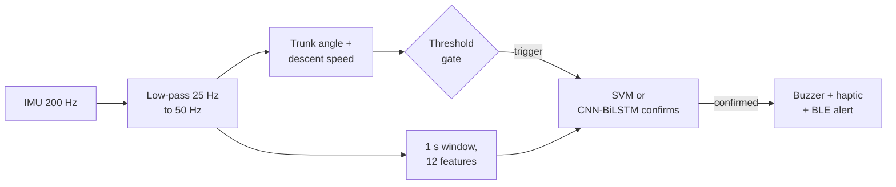

<div align="center">

# Pre-fall prediction for elderly wearables

**Smart insole vs. wristband: from simulated sensors to TinyML, a caregiver demo and ESP32 firmware**

[](https://github.com/chiranshee26-source/prefall-wearables/actions/workflows/ci.yml)


[**Live demo**](https://chiranshee26-source.github.io/prefall-wearables/) ·
[Results](docs/results.md) ·
[Architecture](docs/architecture.md) ·
[Firmware](firmware/README.md) ·
[Deck vs. measured](docs/deck-vs-measured.md) ·
[Real datasets](docs/real-data.md)

</div>

---

## Overview

Reactive fall pendants alert only after impact. This project targets the **200 to 400 ms before impact**, when a
wearable can still trigger a warning. It is the software side of a B.Tech embedded systems seminar comparing a smart
insole with a wristband, built so that everything runs **without hardware**:

- a physics-based **simulator** of trunk-worn IMU signals (falls, plus the hard cases: fast sitting, jumping, stairs, recovered stumbles)
- the **signal chain, features and detectors** in Python: a threshold rule, Random Forest / SVM / Decision Tree, and CNN-BiLSTM / ConvLSTM
- **INT8 compression** to a 33 KB TFLite model
- a **caregiver demo page** fed by the real pipeline and an 8-byte BLE alert format
- **ESP32-S3 firmware**: a portable C++ core verified against the Python reference, plus a board layer to test once the hardware arrives

> [!WARNING]
> Every result here comes from **simulated** signals. Nothing is clinically validated, and real accelerometer data
> will differ. See [Limitations](#limitations).

## Headline results

Evaluated on 200 held-out simulated trials (83 falls, 117 normal-activity trials, about 40% of them fast sits or stumbles):

| Detector | Falls caught | No false alarm | Mean lead time |
|---|---|---|---|
| Threshold rule alone (tuned for lead time) | 100% | 53% | 238 ms |
| **A.** Threshold, then SVM confirms | 98.8% | 87.2% | 237 ms |
| **B.** INT8 CNN-BiLSTM, positive for 300 ms | 98.8%\* | 100% | 225 ms |

\* For the model committed in `export/`. **A is deterministic; B is not:** retraining from scratch gave 89% of falls caught
at 210 ms lead. See [docs/results.md](docs/results.md) for every table and caveat.

<div align="center">

</div>

**Findings worth knowing:**

- A lone threshold cannot have both a useful lead time and few false alarms. A confirmer fixes that, but **waiting to confirm costs lead time one for one** when the threshold starts the clock.
- A BiLSTM does **not** separate a recovered stumble from a fall on its own. It does once it must stay positive for about 300 ms.
- INT8 quantization lost **no accuracy** (2.7x smaller). Pruning did **not** shrink the file and its accuracy effect was noise.
- Keras 3 LSTMs do not convert to TFLite built-in ops; the deployable model goes through a `tf_keras` copy with identical weights.

## How it works



Two designs are implemented and compared (details in [docs/architecture.md](docs/architecture.md)):
**A** wakes the model only after the threshold fires (cheap on battery, the seminar deck's design);
**B** runs the model on every sample and waits for it to stay positive (fewer false alarms, more power).

## Quick start

Needs Python 3.10 to 3.13. The steps build on each other (each needs the previous ones' output in `data/`).

```bash
git clone https://github.com/chiranshee26-source/prefall-wearables.git
cd prefall-wearables

python -m venv .venv
source .venv/bin/activate          # Windows PowerShell: .venv\Scripts\Activate.ps1
pip install -r requirements.txt    # includes TensorFlow (about 350 MB), which is only needed from step 2b

python scripts/run_step1.py        # simulator, signal chain, threshold detector         (seconds)
python scripts/run_step2a.py       # Random Forest / SVM / Decision Tree                 (seconds)
python scripts/run_step2b.py       # CNN-BiLSTM and ConvLSTM                              (a few minutes)
python scripts/run_step2c.py       # threshold + model confirmation, ML-first            (a few minutes)
python scripts/run_step3.py        # pruning, INT8 TFLite export                          (a few minutes)
python scripts/run_step4.py        # caregiver demo page in docs/demo/                    (a few minutes)

python -m pytest -q                # 23 tests (deep-model tests skip themselves without TensorFlow)
```

Open `docs/demo/prefall_demo.html` in a browser to play back scenarios: live traces, the moment the alert fires, the
phone notification and the decoded BLE payload.

## Real datasets

The same pipeline can be trained and tested on the public **SisFall** and **KFall** datasets (waist / low-back sensors,
subject-wise splits). Loaders and a rehearsal mode are included; see [docs/real-data.md](docs/real-data.md) for how to
get the data and what to expect.

```bash
python tools/make_mock_datasets.py                                          # fake files in the real formats, to rehearse
python scripts/run_real_data.py --dataset sisfall --path data/real/SisFall  # real data, once downloaded
```

> [!NOTE]
> The loaders have been tested on generated files only, not yet on the real downloads.

## Repository layout

```
prefall-wearables/
├── prefall/            Python package: simulator, DSP, features, detectors, models, export, demo builder
├── scripts/            run_step1.py ... run_step4.py, the pipeline in order
├── tests/              pytest suite
├── firmware/
│   ├── core/           portable C++17 detector, verified against Python
│   ├── test/           host test + stand-in headers for a syntax check
│   └── esp32/          ESP32-S3 + MPU-6050 board layer (not yet run on hardware)
├── tools/              export_firmware_assets.py: constants and test vectors for the C++ core
├── export/             the INT8 model: cnn_bilstm_int8.tflite and a C array for the firmware
├── docs/               results, architecture, deck-vs-measured, images, demo (GitHub Pages)
└── data/               generated at run time (git-ignored)
```

## Firmware

| Part | Status |
|---|---|
| `firmware/core` (filter, tracker, features, SVM, detector, alert payload) | **Verified** against Python on 12 trials: all alerts and payload bytes identical |
| `firmware/esp32` (MPU-6050, buzzer, BLE, main loop) | Compiles against stand-in headers only. **Not built with the real toolchain, never run on a board** |
| TFLite Micro adapter for detector B | Written, never compiled |

```bash
python tools/export_firmware_assets.py
g++ -std=c++17 -O2 -Wall -Wextra -Ifirmware/core firmware/test/host_test.cpp -o host_test
./host_test firmware/test/vectors.bin      # RESULT: PASS
```

[firmware/README.md](firmware/README.md) has a 10-step bring-up checklist for the first day with the board.

## Limitations

- **Simulated data only so far.** Loaders for SisFall and KFall are included but have not yet been run on the real files. The simulator encodes the physics the seminar deck describes (weightlessness dip, tilt, impact spike). Real falls, real sensor noise, mounting and real walking styles are messier. Expect to collect recordings and re-run the pipeline before trusting any figure.
- **Small test set.** 117 normal-activity trials: a measured 100% specificity is compatible with about 97%.
- **IMU only.** The insole's force sensors (FSR) and barometer are not modelled.
- **No on-device numbers yet.** Inference time, alert latency, BLE latency, RAM use and battery life are targets from the deck, not measurements.
- **Not a medical device.**

## Roadmap

- [x] Simulator, signal chain, threshold detector
- [x] Classical and deep models, comparison of two-stage and ML-first detectors
- [x] INT8 TFLite export (33 KB), caregiver demo
- [x] Portable C++ core verified against Python
- [ ] Run the firmware on an ESP32-S3 + MPU-6050 and measure latency
- [x] Loaders for SisFall and KFall (tested on generated files only)
- [ ] Run the pipeline on the real SisFall / KFall data
- [ ] Record real IMU data and re-evaluate
- [ ] Wrist-worn data (FallAllD) for the wristband variant
- [ ] Insole (FSR) variant and cost model in INR

## Related work

As cited in the seminar deck (verify details before citing elsewhere): Wu (2000) velocity-threshold fall detection;
Ahn et al. (2019) pre-impact detection algorithms on SisFall; Sucerquia et al. (2017) SisFall; Yu et al. (2021) KFall;
Koo et al. (2023) TinyFallNet.

## License

[MIT](LICENSE)
