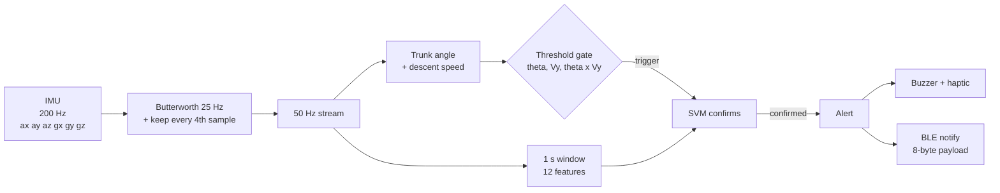

# Architecture

## Signal chain

Everything below the sensor runs on the device. The same chain exists twice: in Python (`prefall/`, used for
training and evaluation) and in C++ (`firmware/core/`, verified against the Python version).

- **Front end.** The 25 Hz low-pass sits exactly at Nyquist for 50 Hz sampling, so it is applied at the raw
  200 Hz rate before decimating (`prefall/dsp.py`, `firmware/core/frontend.h`).
- **Tracker.** Trunk angle from a complementary filter (gyro integration corrected by the accelerometer
  whenever |a| is within 0.7 to 1.3 g); descent speed as the leaky integral of vertical acceleration minus 1 g.
- **Threshold gate.** `theta > theta_crit and Vy > v_thr and theta * Vy > tau`, calibrated on the training trials only.
- **Features.** Mean, variance, RMS, min, max of |a|; signal magnitude area; zero-crossing rate; dominant
  frequency; gyro mean and max; peak tilt; peak descent speed.

## Two detector designs

| | A: threshold, then SVM (the seminar deck's design) | B: ML-first with persistence |
|---|---|---|
| Who starts the clock | the threshold gate | the model's own first positive |
| Model | RBF SVM, 400 support vectors, about 20 KB, plain C++ | INT8 CNN-BiLSTM, 32.8 KB, needs TFLite Micro |
| Alert rule | SVM positive at the trigger sample | model positive continuously for 300 ms |
| Runs the model | only after a trigger | on every sample (50 per second) |
| Battery | lower | higher (continuous inference) |
| Measured (simulated data) | 98.8% falls caught, 87.2% no false alarm, 237 ms lead | 98.8%, 100%, 225 ms |

Waiting to confirm costs lead time one for one when the threshold starts the clock, because the threshold fires late
(about 238 ms before impact). The model recognises a fall earlier (about 460 ms), so design B can afford to wait.

## Why the deployable model is a `tf_keras` copy

Keras 3 compiles an LSTM into TensorList loops that the TFLite converter cannot lower to built-in ops (conversion
fails), and unrolling the loop instead produces a 377 KB file. Legacy Keras 2 (`tf_keras`) LSTMs convert to TFLite's
fused `UNIDIRECTIONAL_SEQUENCE_LSTM`. The trained weights are copied across exactly (`prefall/deploy.py`,
probability difference 0.0), giving a 32.8 KB INT8 model with 8 built-in ops and no Flex ops. `ConvLSTM1D` has no such
path and was not deployed.

## Real data

`prefall/realdata.py` loads SisFall and KFall into the same `Trial` objects the simulator produces: it converts raw
units, estimates each dataset's axis frame from the recordings, and reads KFall's fall-onset and impact labels.
SisFall has no timing labels, so its impact time is estimated from the acceleration peak. See
[real-data.md](real-data.md).

## Evaluation protocol

- Split by **trial** (first half of the shuffled trials train, second half test), never by window.
- A fall counts as caught if an alert lands between fall onset and impact; lead time is impact minus alert time.
  A normal-activity trial with any alert is a false alarm ("no false alarm" in the tables is trial level).
- Decisions are made on windows ending at every 20 ms sample, so alert times are exact to 20 ms.
- The simulator includes hard negatives on purpose: fast sitting, jumping, stairs and a recovered stumble.
  About 40% of the normal-activity trials are fast sits or stumbles, so trial-level specificity is lower than
  it would be on a realistic daily mix.
