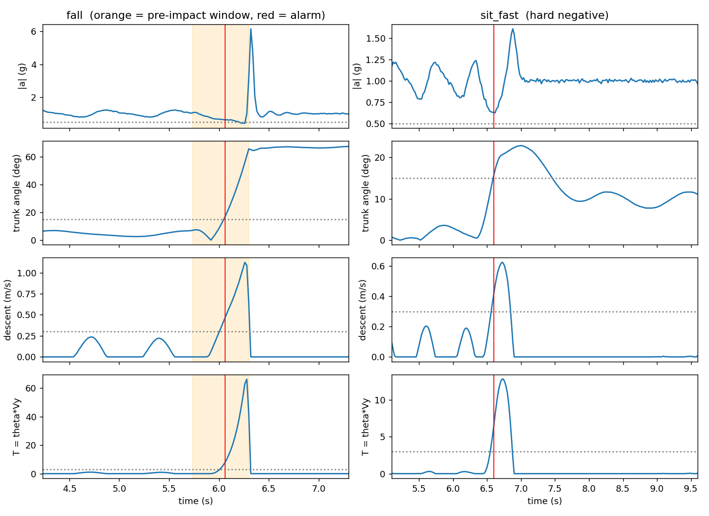
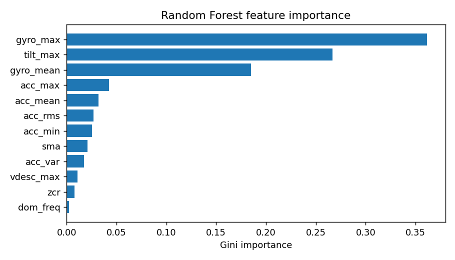

# Results

> [!IMPORTANT]
> All numbers come from **simulated** sensor data (`prefall/synth.py`), 400 trials (160 falls, 240 normal
> activity), evaluated on 200 held-out trials (83 falls, 117 normal). They are not clinical evidence and are not
> comparable to published benchmarks. Training is not bit-exact between runs (TensorFlow multithreading,
> scikit-learn versions), so expect a few points of drift in the model numbers.
> Regenerate everything with the commands in the [README](../README.md#quick-start).

## Threshold detector (step 1)

| Setting | Falls caught | No false alarm | Mean lead | Falls with 200 ms or more |
|---|---|---|---|---|
| Tuned for specificity (at least 90%) | 100% | 97.4% | 118 ms | 1.2% |
| Tuned for lead time (first pass) | 100% | 53.0% | 238 ms | 74.7% |

A lone threshold cannot have both a useful lead time and few false alarms. The first-pass setting sends fast sits
and stumbles (100% of them) to the confirmer.

## Classical models (step 2a), fired on every window

| Model | Falls caught | No false alarm | Mean lead |
|---|---|---|---|
| Random Forest (100 trees, depth 8) | 100% | 65-66% | 457-463 ms |
| SVM (RBF) | 100% | 70.9% | 467 ms |
| Decision Tree (depth 8) | 100% | 60.7% | 461 ms |

Top Random Forest features: gyro peak (0.36), peak tilt (0.27), gyro mean (0.17). Forest size is 5.5-6.9 thousand
nodes, roughly 65-80 KB at 12 bytes per node.

## Deep models (step 2b)

| Model | Parameters | FP32 | Falls caught | No false alarm | Mean lead |
|---|---|---|---|---|---|
| 1D-CNN + BiLSTM | 20,850 | 81 KB | 100% | 56-63% | 448-463 ms |
| ConvLSTM | 9,506 | 37 KB | 100% | 54% | 458 ms |

## Two-stage and ML-first detectors (step 2c)

Threshold starts the clock, model confirms after waiting `d` ms:

| Confirmer | Wait 0 ms | Wait 100 ms |
|---|---|---|
| SVM | 98.8% caught, 87.2% no false alarm, 237 ms lead | 98.8%, 91.5%, 140 ms |
| CNN-BiLSTM | 100%, 71%, 238 ms | 100%, 97%, 138 ms |

Model starts the clock, must stay positive for `d` ms (no threshold):

| Model | d = 200 ms | d = 300 ms |
|---|---|---|
| SVM | 100% caught, 86.3% no false alarm, 351 ms lead | 98.8%, 91.5%, 250 ms |
| CNN-BiLSTM | 94%, 75%, 324 ms | 87-96% caught, 100% no false alarm, 211-225 ms |

In the ML-first setting with a 300 ms wait, both deep models reject every recovered stumble (0% false alarms) while
the SVM and Random Forest still flag 43% and 61%. On its own, no model separates a stumble from a fall.

## Compression and export (step 3)

| CNN-BiLSTM version | File size | gzip | No false alarm | Agreement with FP32 |
|---|---|---|---|---|
| FP32 TFLite | 88.5 KB | 78 KB | n/a | n/a |
| INT8 | **32.8 KB** | 24 KB | 57-64% | 99.9-100% of windows |
| Pruned 35% + INT8 | 32.9 KB | 21 KB | 56-70% | 99.9% of windows |

- INT8 quantization costs no accuracy on this data. Ops used: CONCATENATION, CONV_2D, FULLY_CONNECTED, RESHAPE,
  REVERSE_V2, SOFTMAX, STRIDED_SLICE, UNIDIRECTIONAL_SEQUENCE_LSTM. All are registered in TFLite Micro's
  `MicroMutableOpResolver`; on-device behaviour is untested.
- Pruning does **not** shrink the `.tflite` file (zeros are still stored); only gzip sees the saving. In three
  runs the pruned model scored 6-10 points higher, but in a fresh retrain it did not (56% against 57%), so treat that
  as run-to-run noise, not a benefit of pruning.

## End to end with the deployable pieces (step 4)

Threshold detector + SVM, and the exported INT8 model file, run per sample on all 200 test trials:

| | Falls caught | No false alarm | Mean lead | Falls with 200 ms or more |
|---|---|---|---|---|
| A: threshold, then SVM | 98.8% | 87.2% | 237 ms | 73.5% |
| B: INT8 CNN-BiLSTM, 300 ms | 98.8% | 100% | 225 ms | 61.4% |

These are the numbers for the model committed in `export/`. **Detector A is deterministic** (threshold and SVM). **Detector B
depends on the training run:** retraining from scratch gave 89.2% of falls caught, 100% no false alarm and 210 ms lead
(and 86.7% to 96% in step 2c runs). Do not quote B's sensitivity as a single number.

With 117 normal-activity trials, a measured 100% specificity is compatible with a true value around 97%.

## Real data: SisFall (38 subjects, full dataset)

Everything above is simulated. This section is the pipeline run for real on
[SisFall](https://doi.org/10.3390/s17010198) — 4,495 recordings, 1,788 falls, split by subject (11 held out,
never seen in training). See [`docs/real-data.md`](real-data.md) for how to reproduce this and the caveats
that apply (SisFall has no fall-timing labels, so lead time is estimated, not measured).

| Detector | Falls caught | No false alarm | Mean lead | Elderly: no false alarm |
|---|---|---|---|---|
| Threshold alone | 70.5-72.9% | 19.4-21.9% | 418-478 ms | 7-15% |
| **A: threshold, then SVM confirms** | **63.0-63.7%** | **33.5-42.8%** | 401-457 ms | 14-25% |
| A: threshold, then Random Forest | 60.7-61.2% | 36.1-45.6% | 399-452 ms | 12-27% |
| ML-first: SVM, 200-300 ms | 42.9-44.1% | 14.6-25.5% | 440-550 ms | 9-15% |
| ML-first: Random Forest, 300 ms | 41.9-44.0% | 17.1-27.9% | 374-495 ms | 12-19% |

Ranges are across two random subject splits (seed 0 and seed 1); see below for why they're reported as ranges,
not single numbers.

**The two-stage detector (threshold gate, then ML confirms) clearly beats ML-first on real data** — roughly 20
points higher on both sensitivity and specificity than any ML-first policy, the opposite of what the ML-first
policy showed on simulated data. Real sensor noise breaks the "model stays positive for d ms straight"
assumption ML-first depends on: it causes both missed falls (noise interrupts a true positive streak) and false
alarms (noise sustains a false one), while the threshold gate is a cheap, robust first filter.

**Numbers here are much lower than the simulated results above, and that gap is itself the honest finding.**
Real recordings have sensor noise, varied gait, and fall types the simulator does not model.

**Elderly-specific specificity is worse than the overall number** (14-25% against 33-43% overall) — the detector
false-alarms more often on the actual target population than on the dataset as a whole. This is the clearest
real limitation and worth stating directly rather than only quoting the overall figure.

**Sensitivity is stable across the two seeds (~63%); specificity and lead time are not** (a ~10-point and
~55 ms swing between seeds). With only 11 subjects held out each time, a handful of people decide the result —
report sensitivity as a point estimate, specificity as a range, and don't trust the elderly-only number as a
single figure.

**Hardest fall type: F05** (16-26% caught across seeds), a lateral fall — the threshold gate assumes forward or
backward tilt, so it structurally misses more of these; the model-based detectors don't depend on tilt
direction but still inherit some of the miss. **Most-triggering daily activities**: D12/D13 (sitting-related)
and D17, all in the 73-100% false-alarm range for detector A.

KFall (fall-onset and impact labeled from video, so trustworthy lead time) is requested and pending approval;
running the same two seeds there will show whether these numbers are SisFall-specific.

## Real data: KFall (32 subjects, full dataset)

A second real dataset, alongside SisFall above: [KFall](https://sites.google.com/view/kfalldataset)
— 5,075 recordings (2,346 falls, 2,729 activities of daily living), split by subject (10 held out,
never seen in training). Unlike SisFall, KFall has fall-onset and impact frames labeled from video,
so the lead-time numbers below are measured, not estimated.

| Detector | Falls caught | No false alarm | Mean lead | Falls with 200 ms or more |
|---|---|---|---|---|
| Threshold alone | 88.9% | 28.8% | 457 ms | 85.6% |
| **A: threshold, then SVM confirms** | **84.9%** | **62.8%** | **456 ms** | 81.6% |
| A: threshold, then Random Forest | 77.7% | 62.3% | 455 ms | 74.5% |
| ML-first: SVM, 200 ms | 52.9% | 47.2% | 484 ms | 50.6% |
| ML-first: SVM, 300 ms | 57.5% | 54.4% | 408 ms | 50.3% |
| ML-first: Random Forest, 300 ms | 63.6% | 54.2% | 378 ms | 51.7% |

**Detector A does much better here than on SisFall** (84.9% caught / 62.8% no false alarm here,
against 63.0–63.7% / 33.5–42.8% on SisFall). This is not evidence the model itself improved —
it's the same pipeline, same architecture. Two real differences in the data explain most of the
gap: KFall's falls are scripted and performed by young adult subjects under controlled conditions,
which produces more consistent motion signatures than SisFall's more varied elderly-inclusive fall
styles; and KFall's onset/impact timing is ground truth from video, while SisFall's is an estimate.
Read this as "KFall is an easier detection problem for this pipeline," not as a claim the detector
generalizes better.

**Caveat: the automatic axis-calibration step flagged KFall's data directly.** The pipeline warned
`gyro/accelerometer match is weak (correlation 0.05): the gyro may be in a different frame; the
threshold detector will be unreliable` while loading KFall — meaning it was not confident about
which sensor axis is "up" for this dataset's recordings. The numbers above still ran and completed,
but the threshold detector (and therefore Detector A, which gates on it) carries more uncertainty
here than the equivalent SisFall numbers, which did not trigger this warning.

**Hardest fall types: T21 and T24** (65% caught each); easiest: T27 and T28 (98–100%).
**Most-triggering daily activities for Detector A**: T15 (91%), T18 (74%), T16 (70%).

KFall does not include an elderly-specific subgroup the way SisFall does (SisFall's participant
pool spans young and elderly adults; KFall's does not), so there is no KFall equivalent of the
"elderly-specific specificity" comparison above.

## Firmware core vs Python (`firmware/test`)

12 test trials, three detector configurations, both from Python's own 50 Hz stream and from raw 200 Hz samples:

| Component | Maximum difference from Python |
|---|---|
| Filter + decimation | 4.6e-05 |
| Trunk angle / descent speed | 3.8e-05 deg / 3.6e-07 m/s |
| Features (all but zero-crossing rate) | 4.8e-07 relative |
| SVM decision value | 1.0e-04, same class on every window |
| Alerts and 8-byte payloads | 18 of 18 identical |

One window's zero-crossing count differed by a crossing (float32 against float64 on a sample sitting on the mean);
no decision changed.
